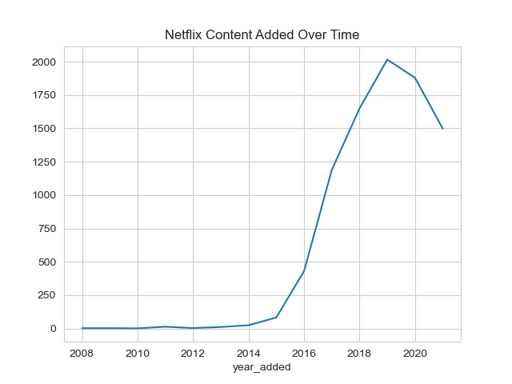
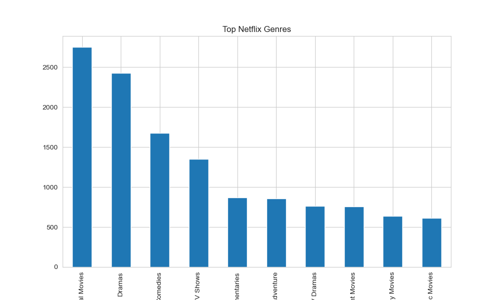
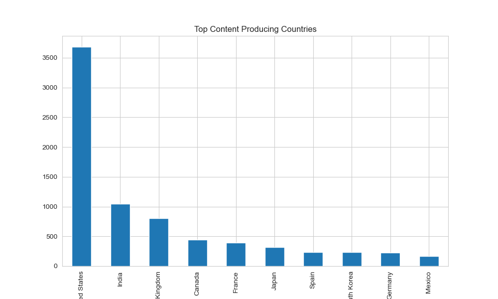
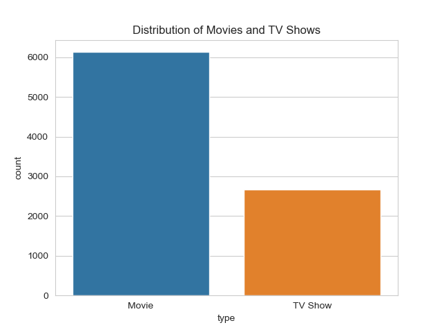

# Netflix Content Analysis 📊

## Project Overview

This project analyzes Netflix content data to uncover insights about content distribution, growth trends, genres, and global production patterns.

The goal is to understand how Netflix has evolved over time and identify key characteristics of its content strategy.

---

## Business Questions

This analysis aims to answer the following questions:

• What is the distribution of Movies vs TV Shows on Netflix?  
• How has Netflix content grown over time?  
• Which genres are most common?  
• Which countries produce the most content?  
• How recent is the content available on Netflix?  
• What are the typical characteristics of Netflix movies?  

---

## Dataset Description

The dataset contains information about Netflix titles, including:

• Content type (Movie / TV Show)  
• Title, Director, Cast  
• Country of production  
• Release year and date added to Netflix  
• Duration (minutes or seasons)  
• Genre (listed categories)  
• Content rating  

---

## Data Cleaning & Preprocessing

The dataset was cleaned to ensure accurate analysis:

• Converted `date_added` to datetime format  
• Removed rows with missing `date_added`  
• Filled missing values in `rating` with "Unknown"  
• Extracted numeric values from the `duration` column for movies  
• Handled multi-value columns (`country`, `listed_in`) using split and explode  

---

## Key Analysis Performed

### 1. Content Distribution
Analyzed the proportion of Movies vs TV Shows.

### 2. Content Growth Over Time
Studied how Netflix content has expanded over the years.

### 3. Content Growth by Type
Compared growth trends for Movies and TV Shows separately.

### 4. Genre Analysis
Identified the most common genres on Netflix.

### 5. Country Analysis
Analyzed top content-producing countries.

### 6. Content Age Analysis
Calculated the gap between release year and Netflix addition.

### 7. Movie Duration Analysis
Studied distribution of movie durations.

### 8. Director Analysis
Identified directors with the highest number of titles.

---

## Key Insights

• Netflix experienced rapid content growth after 2016, indicating platform expansion.  
• Movies dominate the catalog, but TV Shows are steadily increasing.  
• The United States produces the majority of content, with growing contributions from India and other countries.  
• Drama and International Movies are the most common genres.  
• Most content is added within a few years of release, showing a focus on recent content.  
• Movie durations are concentrated around 90–100 minutes, aligning with industry standards.  
• Increasing content diversity reflects Netflix’s global expansion strategy.  

---

## Sample Visualizations

---

## Tools & Technologies Used

• Python  
• Pandas  
• Matplotlib  
• Seaborn  
• Jupyter Notebook  

---

## Project Structure

Netflix_Content_Analysis/
│
├── Netflix_Content_Analysis.ipynb
├── netflix_titles.csv
├── images/
│ ├── content_growth.png
│ ├── type_distribution.png
│ ├── top_genres.png
│ └── top_countries.png
└── README.md

---

## Conclusion

This analysis highlights Netflix’s rapid growth, evolving content strategy, and increasing global presence.

The platform is shifting towards diverse, international content while maintaining a strong foundation of traditional movie formats.

---

## Author

**Shashwat Krishna**  
Aspiring Data Analyst  

Skills:
• SQL  
• Python  
• Data Analysis  
• Power BI  
